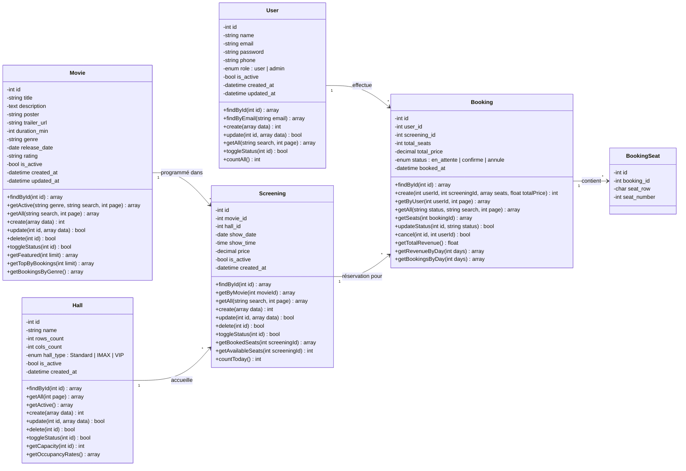

# Diagramme de Classes — CinéBook

## Plateforme de Réservation Cinéma

> Projet PHP/JS — Diagramme UML des entités du système

## Description des relations

| Relation | Cardinalité | Description |
|----------|-------------|-------------|
| User → Booking | 1..* | Un utilisateur peut effectuer plusieurs réservations |
| Movie → Screening | 1..* | Un film peut avoir plusieurs séances |
| Hall → Screening | 1..* | Une salle accueille plusieurs séances |
| Screening → Booking | 1..* | Une séance peut avoir plusieurs réservations |
| Booking → BookingSeat | 1..* | Une réservation contient un ou plusieurs sièges |

## Entités gérées (hors User)

1. **Movie** (Film) — CRUD complet avec upload d'affiche
2. **Hall** (Salle) — CRUD complet avec types (Standard, IMAX, VIP)
3. **Screening** (Séance) — CRUD complet avec lien film/salle
4. **Booking** (Réservation) — Création, consultation, confirmation, annulation
